autoscale: true

#[fit] End of Days

---

# What was this course about?

- Machine Learning
- Deep Learning
- Really just thinking, the process

---


## Along the way we

- learn how to create and regularize models
- learn how to optimize objective functions such as loss functions using Stochastic Gradient Descent
- learnt how to create (simple) archirectures to solve problems
- learnt how to transfer from one model to the next

---


#[fit]Concepts running through:

- Fitting parameters vs hyperparameters
- Regularization
- Validation testing
- Stochastic Gradient Descent
- Learning representations

---

## Tablular data and Pandas


---

#[fit] Regression

---

## KNN Regression

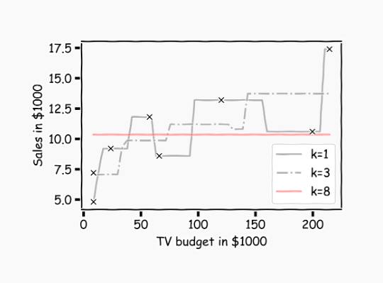

---

## Residuals and their minimization

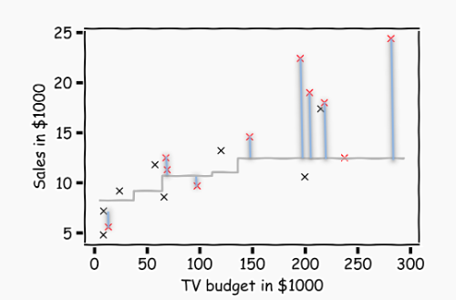

---

## How to fit: sklearn

```python
Xtrain, Xtest, ytrain, ytest = train_test_split(X, y, test_size=0.2)
lr2 = LinearRegression().fit(Xtrain, ytrain)
r2_test = r2_score(ytest, lr.predict(Xtest))
r2_train = r2_score(ytrain, lr.predict(Xtrain))
```
---

## How to fit: Keras

```python
inputs_placeholder = Input(shape=(1,))
outputs_placeholder = Dense(1, activation='linear')(inputs_placeholder)

m = Model(inputs=inputs_placeholder, outputs=outputs_placeholder)
m.compile(optimizer='sgd', loss='mean_squared_error',  metrics=['mae','accuracy'])
m.summary()
```
---

## Frequentist Statistics

>"data is a **sample** from an existing **population**"

- data is stochastic, variable; parameters fixed
- fit a parameter
- samples (or bootstrap) induce a sampling distribution on any estimator
- example of a very useful estimator: MLE


---

## Multiple fits from multiple samples

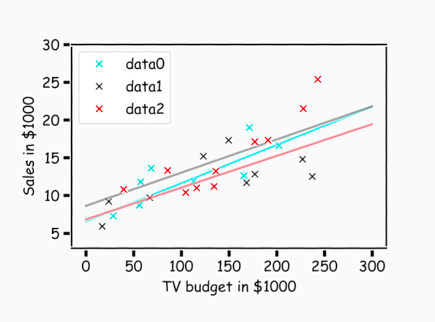

---

## Regression line uncertainty vs prediction uncertainty


---

#[fit] Learning

---

#Statement of the Learning Problem

The sample must be representative of the population!


$$A : R_{\cal{D}}(g) \,\,smallest\,on\,\cal{H}$$
$$B : R_{out} (g) \approx R_{\cal{D}}(g)$$


A: Empirical risk estimates in-sample risk.
B: Thus the out of sample risk is also small.

---

## Bias or Underfitting


---

## Data size matters


---

#UNDERFIT(Bias) vs OVERFIT (Variance)


---


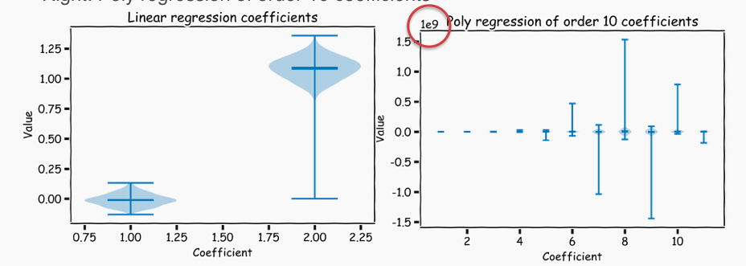

---

## Validation, X-Val


---


## Dont Overfit


---

## Regularization


---

## Make em behave!


---

## Geometry of regularization

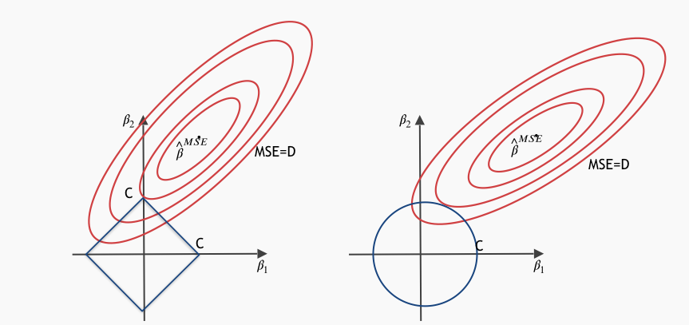

---

#[fit] Classifcation

---

## With Linear Regression

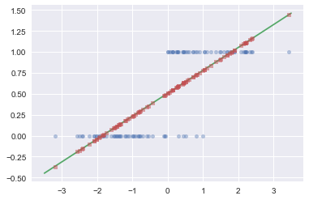

---

## With Logistic Regression


---

## Sigmoid function

This function is plotted below:

```python
h = lambda z: 1./(1+np.exp(-z))
zs=np.arange(-5,5,0.1)
plt.plot(zs, h(zs), alpha=0.5);
```


Identify: $$\renewcommand{\v}[1]{\mathbf #1} z = \v{w}\cdot\v{x}$$ and $$ \renewcommand{\v}[1]{\mathbf #1} h(\v{w}\cdot\v{x})$$ with the probability that the sample is a '1' ($$y=1$$).

---

Then, the conditional probabilities of $$y=1$$ or $$y=0$$ given a particular sample's features $$\renewcommand{\v}[1]{\mathbf #1} \v{x}$$ are:

$$\begin{eqnarray}
\renewcommand{\v}[1]{\mathbf #1}
P(y=1 | \v{x}) &=& h(\v{w}\cdot\v{x}) \\
P(y=0 | \v{x}) &=& 1 - h(\v{w}\cdot\v{x}).
\end{eqnarray}$$

These two can be written together as

$$\renewcommand{\v}[1]{\mathbf #1} P(y|\v{x}, \v{w}) = h(\v{w}\cdot\v{x})^y \left(1 - h(\v{w}\cdot\v{
x}) \right)^{(1-y)} $$

BERNOULLI!!

---

Multiplying over the samples we get:

$$\renewcommand{\v}[1]{\mathbf #1} P(y|\v{x},\v{w}) = P(\{y_i\} | \{\v{x}_i\}, \v{w}) = \prod_{y_i \in \cal{D}} P(y_i|\v{x_i}, \v{w}) = \prod_{y_i \in \cal{D}} h(\v{w}\cdot\v{x_i})^{y_i} \left(1 - h(\v{w}\cdot\v{x_i}) \right)^{(1-y_i)}$$

Indeed its important to realize that a particular sample can be thought of as a draw from some "true" probability distribution.

 **maximum likelihood** estimation maximises the **likelihood of the sample y**, or alternately the log-likelihood,

$$\renewcommand{\v}[1]{\mathbf #1} {\cal L} = P(y \mid \v{x},\v{w}).$$ OR $$\renewcommand{\v}[1]{\mathbf #1} \ell = log(P(y \mid \v{x},\v{w}))$$

---

Thus

$$\renewcommand{\v}[1]{\mathbf #1} \begin{eqnarray}
\ell &=& log\left(\prod_{y_i \in \cal{D}} h(\v{w}\cdot\v{x_i})^{y_i} \left(1 - h(\v{w}\cdot\v{x_i}) \right)^{(1-y_i)}\right)\\
                  &=& \sum_{y_i \in \cal{D}} log\left(h(\v{w}\cdot\v{x_i})^{y_i} \left(1 - h(\v{w}\cdot\v{x_i}) \right)^{(1-y_i)}\right)\\
                  &=& \sum_{y_i \in \cal{D}} log\,h(\v{w}\cdot\v{x_i})^{y_i} + log\,\left(1 - h(\v{w}\cdot\v{x_i}) \right)^{(1-y_i)}\\
                  &=& \sum_{y_i \in \cal{D}} \left ( y_i log(h(\v{w}\cdot\v{x})) + ( 1 - y_i) log(1 - h(\v{w}\cdot\v{x})) \right )
\end{eqnarray}$$

---
[.autoscale: true]

## Logistic Regression: NLL

The negative of this log likelihood (NLL), also called *cross-entropy*.

$$\renewcommand{\v}[1]{\mathbf #1} NLL = - \sum_{y_i \in \cal{D}} \left ( y_i log(h(\v{w}\cdot\v{x})) + ( 1 - y_i) log(1 - h(\v{w}\cdot\v{x})) \right )$$

Gradient:  $$\renewcommand{\v}[1]{\mathbf #1} \nabla_{\v{w}} NLL = \sum_i \v{x_i}^T (p_i - y_i) = \v{X}^T \cdot ( \v{p} - \v{w} )$$

Hessian: $$\renewcommand{\v}[1]{\mathbf #1} H = \v{X}^T diag(p_i (1 - p_i))\v{X}$$ positive definite $$\implies$$ convex

---

##  Softmax Formulation of Logistic Regression 


---

```python
(X_train, y_train), (X_test, y_test) = mnist.load_data()

# one hot encode outputs
y_train = to_categorical(y_train)
y_test = to_categorical(y_test)
# create model
model = Sequential()
model.add(Flatten(input_shape=(img_width, img_height)))
model.add(Dense(num_classes, activation='softmax'))
model.compile(loss='categorical_crossentropy', optimizer='adam',
              metrics=['accuracy'])
model.summary()
# Fit the model
model.fit(X_train, y_train, epochs=10, validation_data=(X_test, y_test),
          callbacks=[WandbCallback(data_type="image", labels=labels, save_model=False)])
```

---

```python
from sklearn.model_selection import GridSearchCV

pipeline = make_pipeline(TfidfVectorizer(), 
                         LogisticRegression())

grid = GridSearchCV(pipeline,
                    param_grid={'logisticregression__C': [.1, 1, 10, 100]}, cv=5)

grid.fit(text_train, y_train)
print("Score",grid.score(text_test, y_test))
```

---

#[fit] Metrics and
#[fit] Decision Theory

---

## Confusion Matrix


---


---


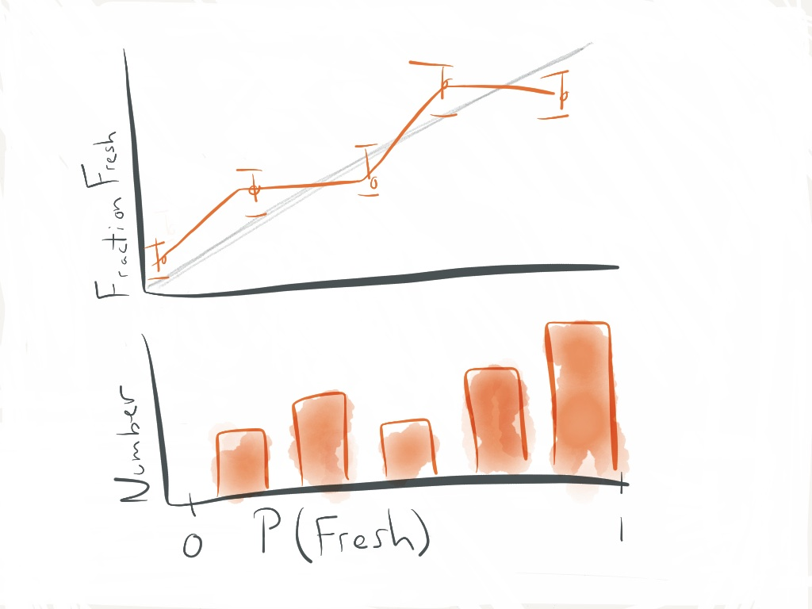

---


---

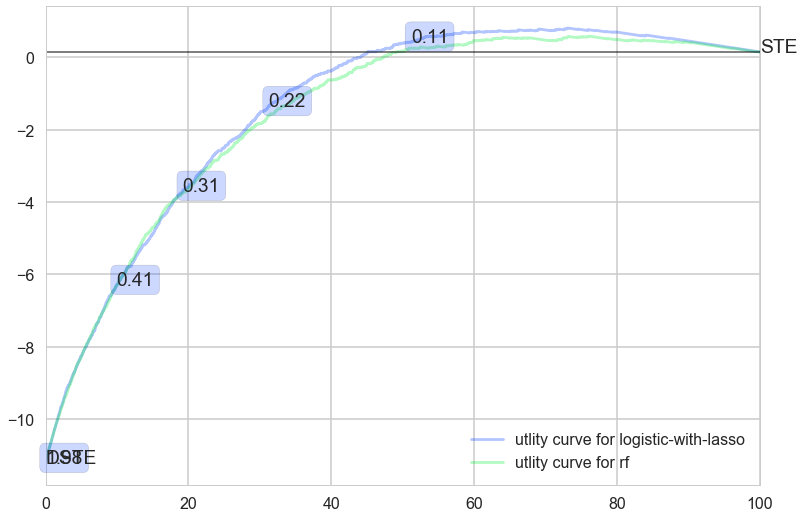

---

#[fit] Trees

---

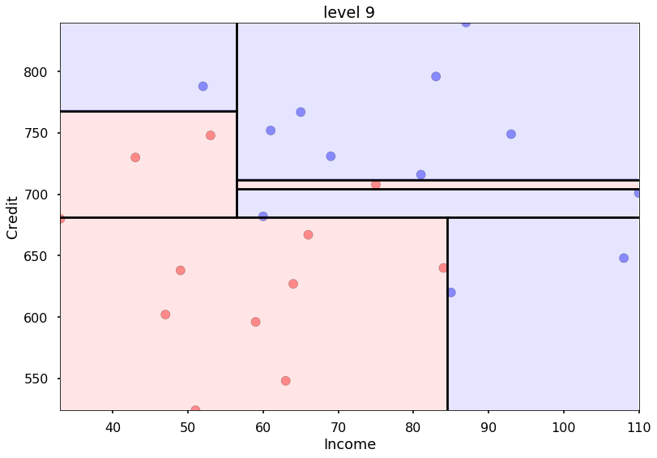

---

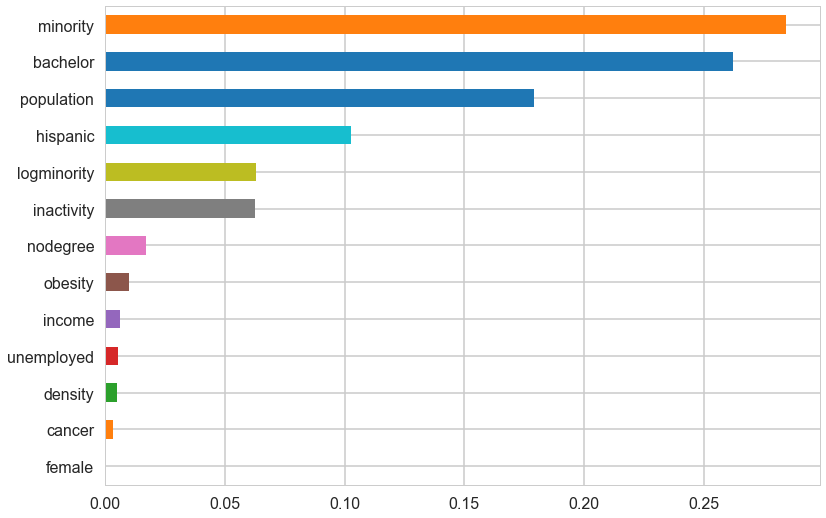

---

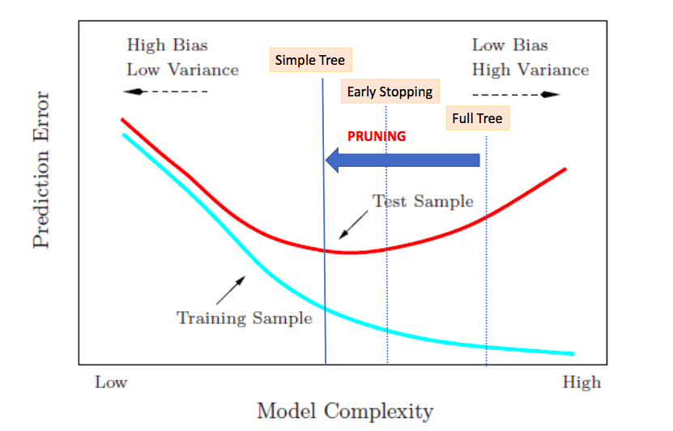

---

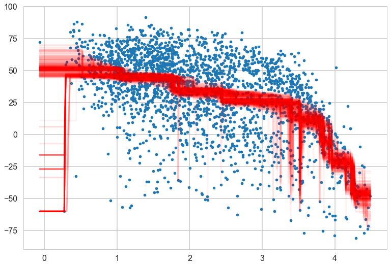

---

## RF

- first do bagging
- then randomly choose features
- Random forest, squeezes out variance
- Big idea is ensembling

---

## Boosting

- use weak learners
- fit residuals
- gradient descent in "data" space
- inspiration for resnets

---

#[fit] Neural
#[fit] Networks

---

## Stochastic Gradient Descent

$$\theta := \theta - \alpha \nabla_{\theta} J_i(\theta)$$

ONE POINT AT A TIME

```python
for i in range(nb_epochs):
  np.random.shuffle(data)
  for example in data:
    params_grad = evaluate_gradient(loss_function, example, params)
    params = params - learning_rate * params_grad
```

Mini-Batch: do some at a time

---


---


---

## Basic Idea: Universal approx by combining nonlinears

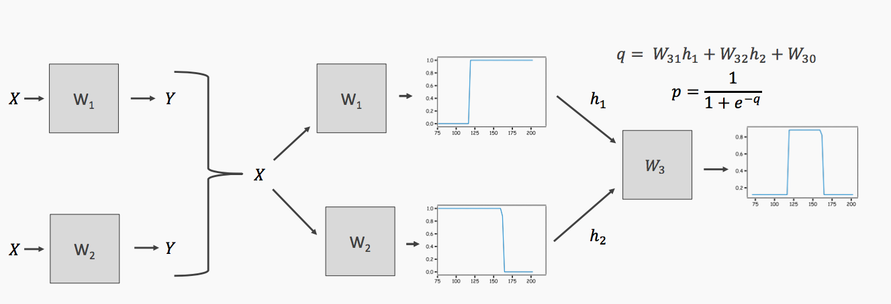

---

## Multi Layer Perceptrons

```python
# create model
model = Sequential()
model.add(Flatten(input_shape=(img_width, img_height)))
model.add(Dense(config.hidden_nodes, activation='relu'))
model.add(Dense(num_classes, activation='softmax'))
model.compile(loss='categorical_crossentropy', optimizer=config.optimizer,
              metrics=['accuracy'])
model.summary()
# Fit the model
model.fit(X_train, y_train, validation_data=(X_test, y_test),
          epochs=config.epochs,
          callbacks=[WandbCallback(data_type="image", labels=labels)])
```
---


---


---


---

## We start with Garbage

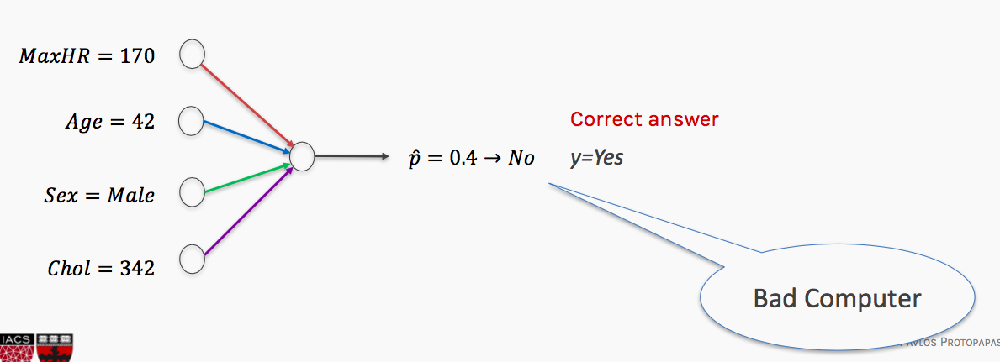

---

## And get better, but we dont need to be best

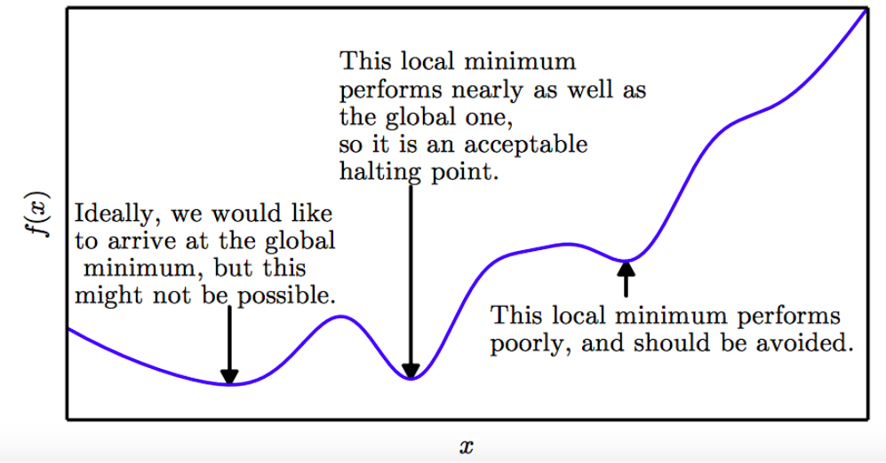

---

## BIG IDEA: learn hierarchical representations

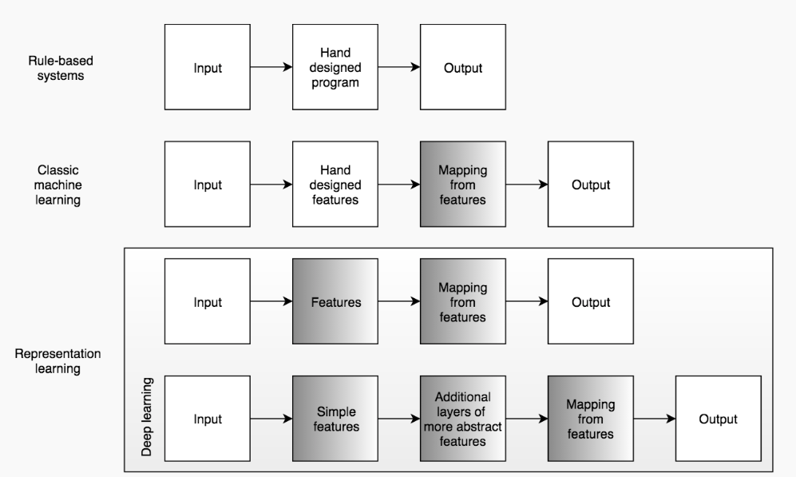

---

## And we need to help it

- MLPs are crude
- we must help computer
- thus use CNNs and RNNs which direct the representations
- directed representation learning is the basis for transfer learning

---

## Three pillars

# GPU

# Automatic Differentiation

# Representation Learning

---

## Statistics: Likelihoods

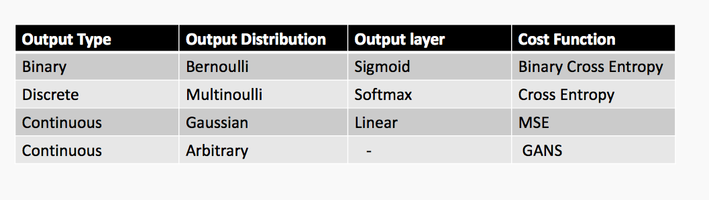

---

#[fit] Practicalities

---

## Problem: Gradient vanishing and explosion

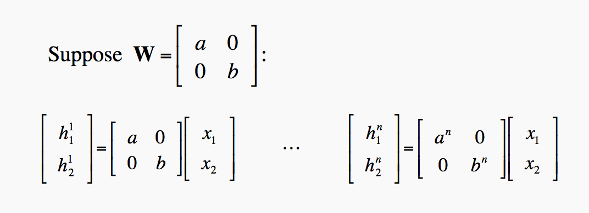

---

## Mitigations and Optimization

- Explosion: Gradient clipping
- Implosion: Skip Connections, Resnets, LSTM, Attention
- Curvature: Momentum, Gradient Accumulation
- Heterogeneity: adaptive learning rates

---

## Initialization

- Uniform or Normal: get unit variance
- Non saturated Bias for Relus
- Feature Normalization
- Batch Norm

---

## Batch Norm

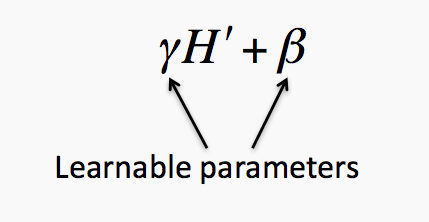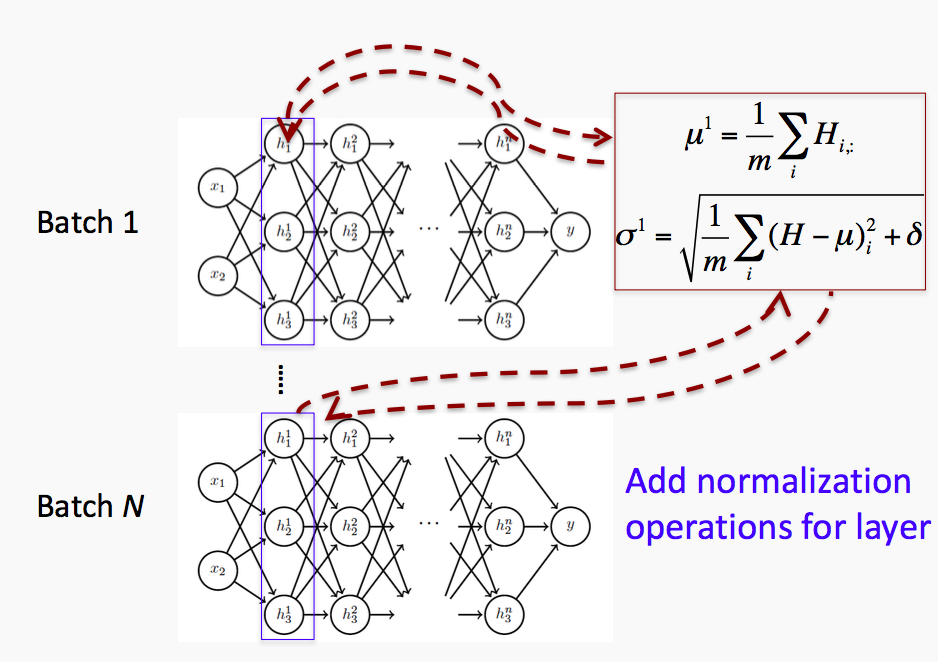

---

#[fit] First Overfit

---

## Dropout


```python
model=Sequential()
model.add(Flatten(input_shape=(img_width,img_height)))
model.add(Dropout(config.dropout))
model.add(Dense(config.hidden_nodes, activation='relu'))
model.add(Dropout(config.dropout))
model.add(Dense(num_classes, activation='softmax'))
model.compile(loss='categorical_crossentropy', optimizer=config.optimizer,
                    metrics=['accuracy'])

```

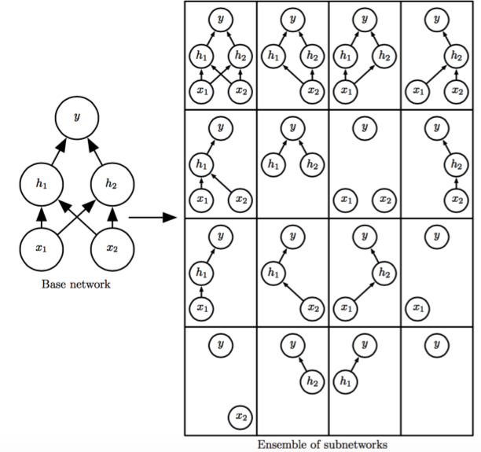

---

## L1/L2: Weight Decay

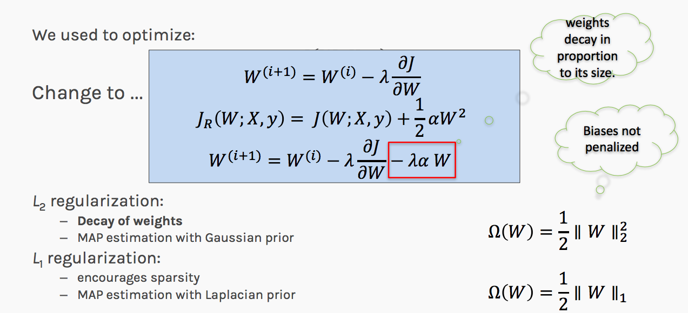

---

## Early Stopping

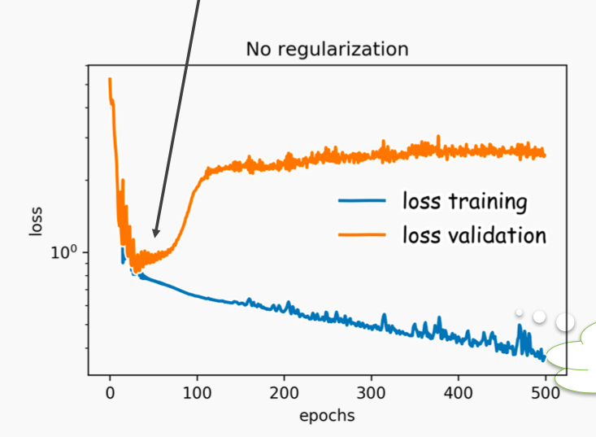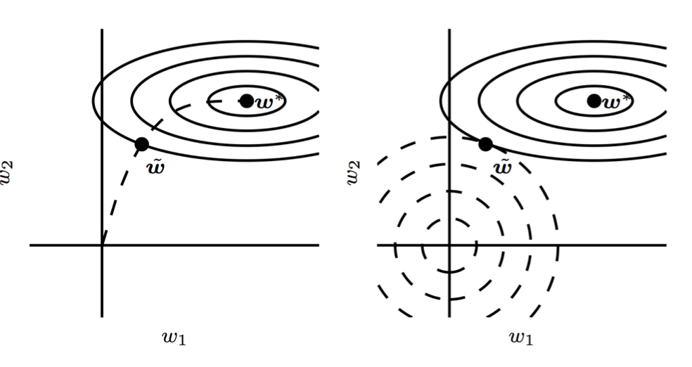

---

## Data Aug

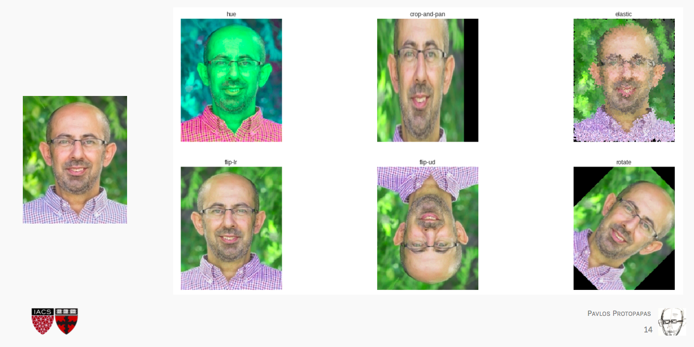

---

## Others

- Bagging
- Adverserial Examples
- Sparse Activations (on activations not weights)

---

#[fit] Convolutional
#[fit] Neural
#[fit] Networks

---

## Exploding params: do weight tying

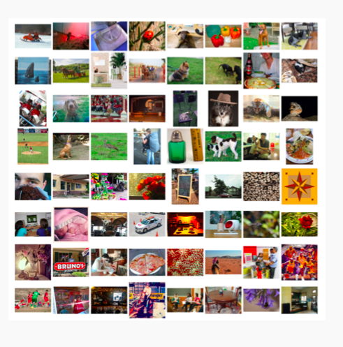

- 3073 params cifar-10
- 150129 Imagenet
- Nearer pizels are related
- And there are symmetries

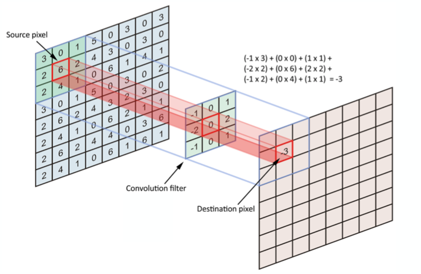

---

# Architecture

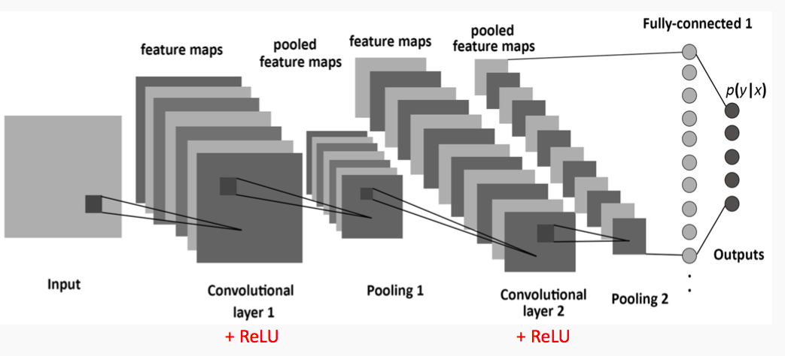

---

# Featuremaps

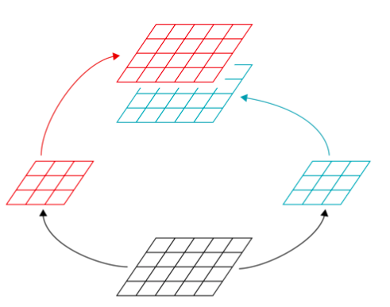

---

#  Receptive Field

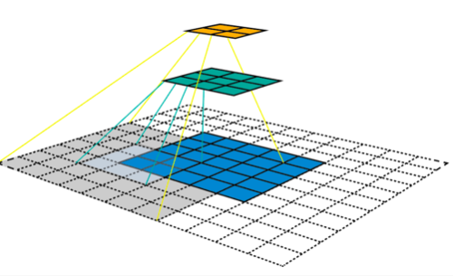

---

#  How fetauremaps in filters work


---

## Things to do

- striding
- padding
- pooling
- upsampling
- 1x1 convolutions
- globalavgpooling
- reshaping, Densing

---

## Recursive Learning


---

## Architectures


---


---


## Transfer Learning


---

 

---

#[fit]Language
#[fit] Modeling
#[fit] + Embeddings

---

## Basic

```python
tokenizer = text.Tokenizer(num_words=config.vocab_size)
tokenizer.fit_on_texts(X_train)
X_train = tokenizer.texts_to_matrix(X_train)
X_test = tokenizer.texts_to_matrix(X_test)

bow_model = LogisticRegression()
bow_model.fit(X_train, y_train)

pred_train = bow_model.predict(X_train)
acc = np.sum(pred_train==y_train)/len(pred_train)

pred_test = bow_model.predict(X_test)
val_acc = np.sum(pred_test==y_test)/len(pred_test)
```

---

## Language Modeling


---

## Word Embeddings


---

## Embeddings are Linear Regression


---

## Learn Embeddings along with Task at hand


---

## Application: Recommendations


---


---

## The reasons for recommendations: similarity and FP


---

## Using Embeddings

```python
model = Sequential()
model.add(Embedding(config.vocab_size,
                    config.embedding_dims,
                    input_length=config.maxlen))
model.add(Conv1D(config.filters,
                 config.kernel_size,
                 padding='valid',
                 activation='relu'))
model.add(Flatten())
model.add(Dense(config.hidden_dims, activation='relu'))
model.add(Dense(1, activation='sigmoid'))

#OR

model.add(Embedding(config.vocab_size, 100, 
input_length=config.maxlen, weights=[embedding_matrix], trainable=False))
model.add(LSTM(config.hidden_dims, activation="sigmoid"))
```

---

## Recurrent Neural networks


---

## Unrolled...


---

## LSTM for long term memory (vanishing gradients)


---


---

## GRU


---

## Other architectures

- cnn on embedding
- cnn-lstm
- stacked deep lstm
- bi-directional lstm
- cnn feeding into part of lstm (captioning)

---


---

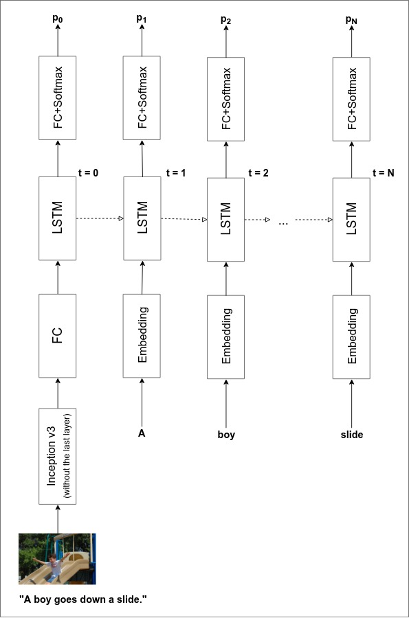

# Captioning

###What other architectures could we use?

---

#[fit] Generative
#[fit] Modeling

---

# p(x)


---

## Big Question: Are these classes?


---

## Concrete Formulation of unsupervised learning

$$
\begin{eqnarray}
l(x \vert  \lambda, \mu, \Sigma) &=& \sum_{i=1}^{m} \log p(x_i \vert  \lambda,  \mu ,\Sigma)   \nonumber \\
     &=& \sum_{i=1}^{m} \log \sum_z p(x_i \vert  z_i,  \mu , \Sigma) \, p(z_i \vert  \lambda)  
\end{eqnarray}
$$

Not Solvable analytically! 

---

## Supervised vs Unsupervised Learning

In **Supervised Learning**, Latent Variables $$\mathbf{z}$$ are observed.

In other words, we can write the full-data likelihood $$p(\mathbf{x}, \mathbf{z})$$

In **Unsupervised Learning**, Latent Variables $$\mathbf{z}$$ are hidden.

We can only write the observed data likelihood:

$$p(\mathbf{x}) = \sum_z p(\mathbf{x}, \mathbf{z}) = \sum_z p(\mathbf{z})p(\mathbf{x}  \vert  \mathbf{z} )$$

COMBINE: Semi supervized learning.

---


---

### In general

## Representations are not classes

## they are tangled, hierarchical complex things

## but learning them

## makes all the difference...

---

## From unsupervised learning

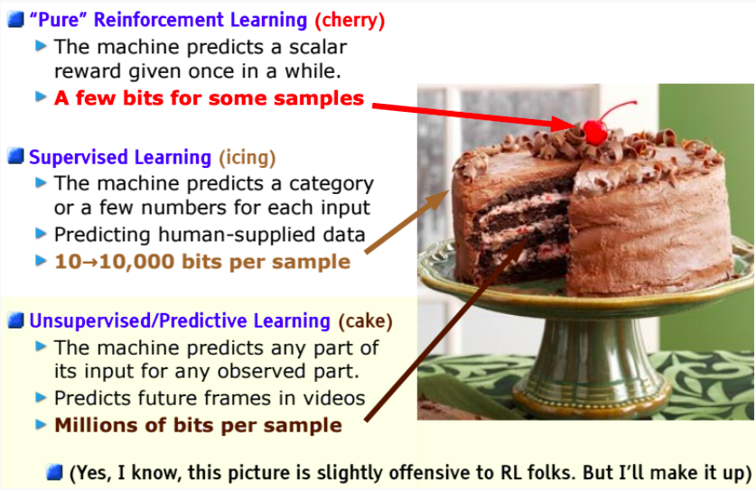

---

## To self-supervized learning

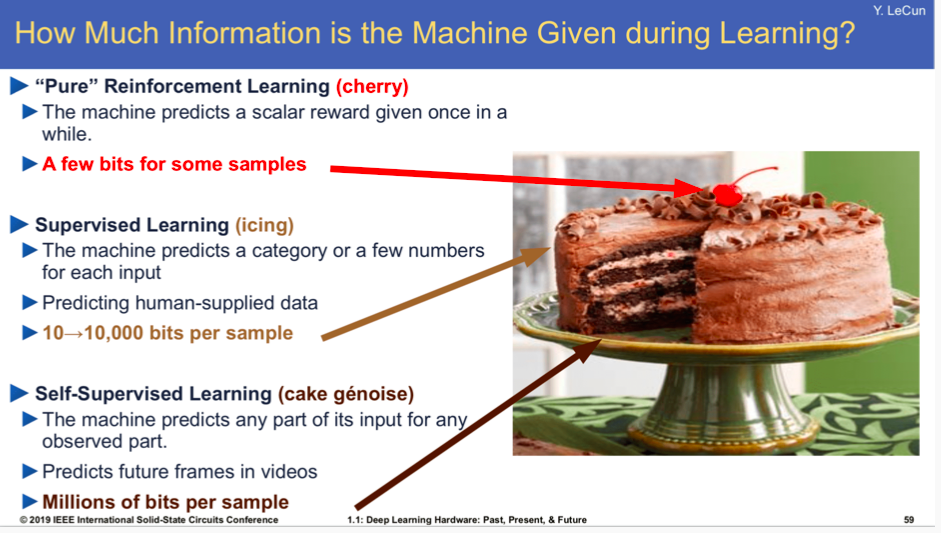

---

## General Encoder-Decoder Architecture

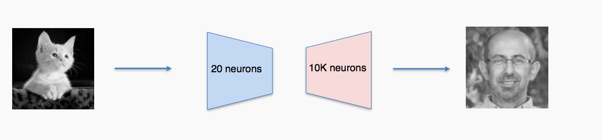

---

## Autoencoder

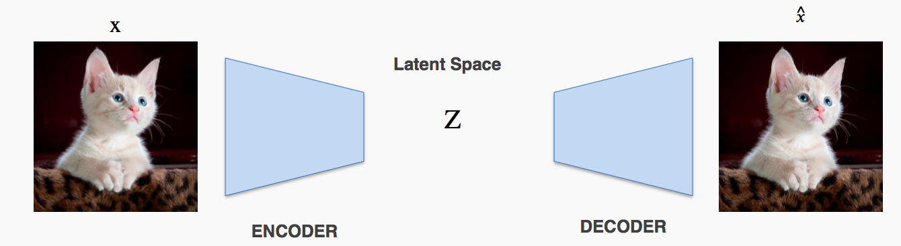

---

## Variational Autoencoder

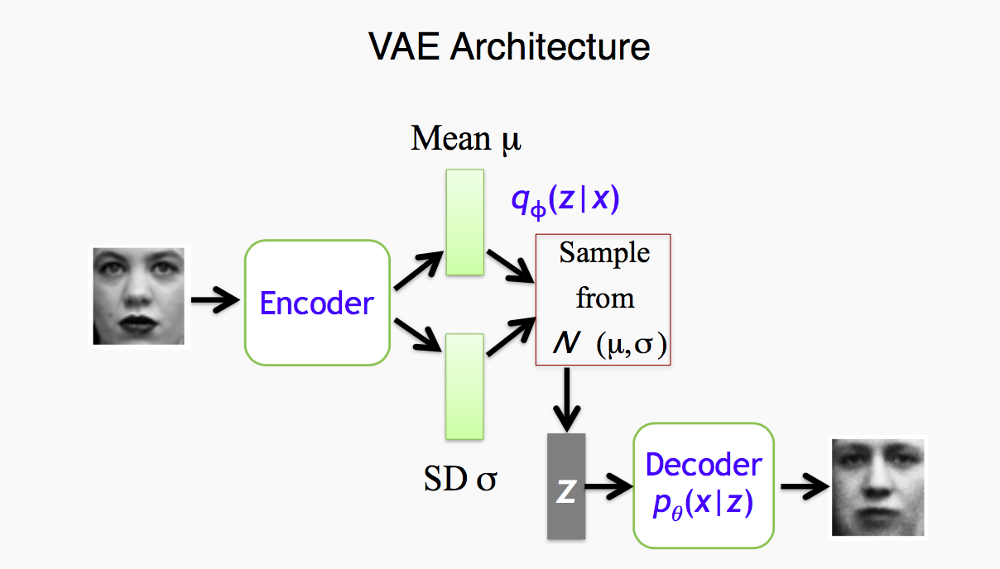

---
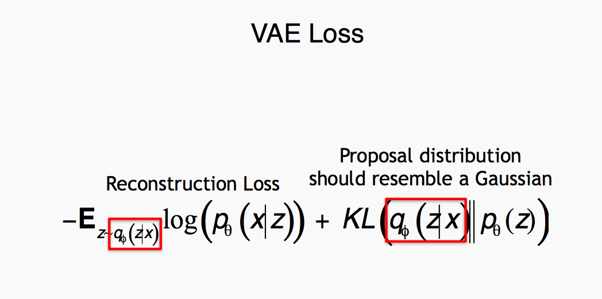

---

## Moving from one rep to the other

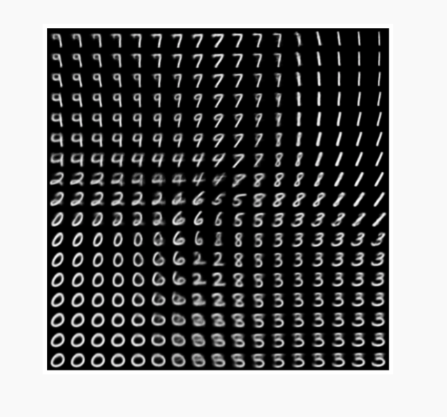

---

## VAE: Deep Generative Models

- simply not possible to do inference in large models
- inference in neural networks: understanding robustness, etc
- hierarchical neural networks
- Mixture density networks: mixture parameters are fitted using ANNs
- extension to [generative semisupervised learning](https://arxiv.org/pdf/1406.5298.pdf)
- [variational autoencoders](https://arxiv.org/pdf/1312.6114.pdf)

---

## Where do we go from here?

### What should you do?

### What should you read? See?

### The advanced course

---

## What should you do?

- There is no substitute for coding.
- We are there to help. Please log onto [https://discourse.univ.ai](https://discourse.univ.ai), so we can have conversations (use your github id).
- In this next week, choose one of the hackings for the course and work (more) on it.
- we will have a hack every 2 weeks (so 2 a month) until the next basics (next 3 months). we'll discuss on Discourse
- suggest topics if interested!

---

## Come TA for us

- we are looking for TAs for the next basics (hybrid on-site/online, october/november) and the advanced (online, november/december). Ping us if you want to do this!
- TAing is the best way to take your learning to a new level, nothing forces you to understand something like having to explain it.
- you will have the opportunity to develop material, and this will help your understanding
- TA training will be provided

---

## Binge Watching/Reading (watch at 1.5x)

- The first session of [fast.ai](https://course.fast.ai/])
- Pattern Recognition and Machine Learning, Bishop
- Deep Learning, Eugene Charniak
- [Deep Learning](https://www.glassner.com/portfolio/deep-learning-from-basics-to-practice/), Andrew Glassner
- Andrew Ng's course is an oldie but goodie. Machine Learning Yearning PDF Document
- [Elements of Statistical Learning](https://web.stanford.edu/~hastie/ElemStatLearn/)

---

## The advanced course

- more applications: super-resolution, image segmentation. etc Unets.
- deep unsupervised learning: GANs, more on autoencoders, autoregressive models, flow models
- Transfer learning in NLP with Bert, Elmo, and ULM-Fit
- model deployment and experimentation
- seq2seq, attention
- bayesian statistics

---

# [fit] Get on Discourse!